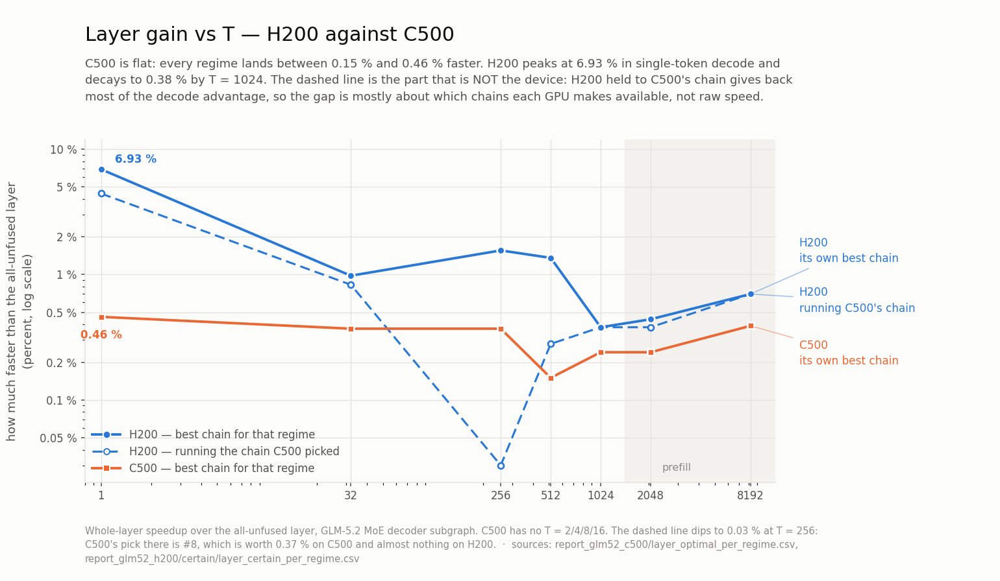
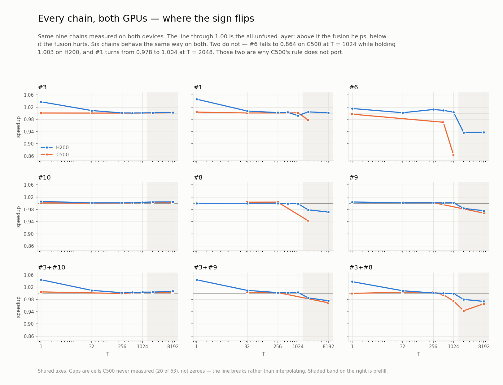

# Layer gain vs T — H200 against C500

Whole-layer speedup of the best fusion chain over the all-unfused layer, GLM-5.2 MoE decoder
subgraph (S3–S11 + shared expert).

| | C500 | H200 |
|---|---|---|
| source | `report_glm52_c500/layer_optimal_per_regime.csv` | `certain/layer_certain_per_regime.csv` |
| protocol | 2 passes × 8 rounds, per-regime autotune, round-spread tie rule | blocked + rotated, frozen configs, bootstrap 95 % CI |
| regimes | 7 | 11 |
| chains | 10 | 18 attempted / 14 measured |
| device | 104 CU, warp 64, 64 KB SMEM, 8 MB L2 | 132 SM, warp 32, 227 KB SMEM, 60 MB L2 |

## Best chain per regime

| T | C500 | | H200 | | H200 excess ÷ C500 excess |
|---:|---|---:|---|---:|---:|
| 1 | #3+#10 | 1.0046 | #1+#6+#9 | **1.0693** | 15.1× |
| 32 | #3+#8 | 1.0037 | #1+#6+#9 | 1.0098 | 2.6× |
| 256 | #8 | 1.0037 | #1+#6+#9 | 1.0156 | 4.2× |
| 512 | #3+#10 | 1.0015 | #1+#6+#9 | 1.0136 | 9.1× |
| 1024 | #3+#10 | 1.0024 | #3+#10 | 1.0038 | 1.6× |
| 2048 | #3+#10 | 1.0024 | #1 | 1.0044 | 1.8× |
| 8192 | #3+#10 | 1.0039 | #3+#10 | 1.0070 | 1.8× |

Excess over 1.000, percentage points:

| | min | median | max |
|---|---:|---:|---:|
| C500 | 0.15 | 0.37 | 0.46 |
| H200 | 0.38 | 0.98 | 6.93 |

Median excess ratio **2.6×**. C500 range spans 3.1× (0.15–0.46 pp); H200 spans 18× (0.38–6.93 pp).

## Shape vs T

- **C500: flat.** All 7 regimes inside 1.0015–1.0046. No T-dependence beyond 0.31 pp.
- **H200: peaked at decode, decaying to prefill.** 1.0693 at T=1 → 1.0098 at T=32 → 1.0038 at T=1024. Decode peak is **15× the C500 peak**; by T=1024 the two converge to within 1.6×.

## Per-chain, C500 / H200

| chain | T=1 | 32 | 256 | 512 | 1024 | 2048 | 8192 |
|---|---|---|---|---|---|---|---|
| #3 | 1.001 / 1.037 | 1.000 / 1.009 | — / 1.001 | 1.000 / 1.001 | 1.001 / 1.001 | 1.001 / 1.002 | 1.001 / 1.003 |
| #10 | 1.001 / 1.006 | 1.000 / 1.001 | 1.001 / 1.001 | 1.001 / 1.002 | 1.002 / 1.003 | 1.002 / 1.004 | 1.003 / 1.004 |
| #3+#10 | 1.005 / 1.044 | — / 1.010 | 0.999 / 1.002 | 1.002 / 1.003 | 1.002 / 1.004 | 1.002 / 1.004 | 1.004 / 1.007 |
| #1 | 1.004 / 1.046 | 1.001 / 1.007 | — / 1.002 | 1.001 / 1.003 | 1.001 / 0.992 | **0.978 / 1.004** | — / 1.001 |
| #6 | 0.997 / 1.015 | — / 1.002 | — / 1.012 | **0.970 / 1.009** | **0.864 / 1.003** | — / 0.937 | — / 0.938 |
| #8 | — / 1.000 | 1.004 / 1.000 | 1.004 / 1.000 | — / 0.999 | — / 0.999 | 0.943 / 0.979 | — / 0.971 |
| #9 | — / 1.004 | 1.003 / 1.001 | 1.002 / 1.002 | — / 1.001 | — / 1.002 | — / 0.983 | 0.968 / 0.976 |
| #3+#9 | — / 1.044 | 1.004 / 1.010 | 1.002 / 1.002 | — / 1.002 | — / 1.003 | — / 0.985 | 0.969 / 0.976 |
| #3+#8 | 1.000 / 1.038 | 1.004 / 1.008 | 1.003 / 1.001 | 0.996 / 1.000 | 0.975 / 0.999 | 0.943 / 0.980 | 0.966 / 0.974 |

Chains with gain > 1.000, of those measured:

| T | 1 | 32 | 256 | 512 | 1024 | 2048 | 8192 |
|---|---|---|---|---|---|---|---|
| C500 | 4/6 | 7/7 | 5/6 | 4/6 | 4/6 | 3/6 | 3/6 |
| H200 | 8/9 | 8/9 | 9/9 | 8/9 | 6/9 | 4/9 | 4/9 |

## Three sign flips

| fusion | C500 | H200 |
|---|---|---|
| **#6** at T=512 / 1024 | 0.970 / **0.864** | 1.009 / 1.003 |
| **#1** at T=2048 | 0.978 | 1.004 |
| **greedy (#1+#6+#9)** | loses at every regime, up to **+48 %** cost | wins 6 of 11 regimes, 1.0693 at T=1 |

C500's rule — *"always #3; #8 for T ≤ 256, #10 from T = 512; never #6, never #1 at prefill,
never fuse greedily"* — holds only in its first clause on H200. Greedy is the H200 decode
optimum from T=1 to T=512.

## Caveats

- Protocols differ: C500 numbers carry no CI, and its 0.15–0.46 pp effects sit against a
  machine logging 25–320 % one-off excursions (LOG-11 §2–3). H200 numbers carry bootstrap
  95 % CIs, and all 7 best-per-regime values above have CIs excluding 1.000; individual
  cells in the per-chain table do not all clear that bar.
- C500 has no T = 2/4/8/16 and no `J_greedy_all`/`#5`/`#4`/`#11b` rows in its layer CSV;
  `—` marks cells never measured, not zero.
- H200 clocks were unlocked; at T ≥ 512 the drift gate discarded 39–88 % of blocks, and
  `prefill_t2048` kept only 21 of 168. Widest best-per-regime CI is `prefill_t8192` at
  ±0.32 %; narrowest is T=256 at ±0.03 %.
- Both devices exclude the attention core, MLA projections and DSA indexer.

## Same chain, both GPUs — H200 running C500's pick

The table above compares each GPU's *own* optimum, so the chains differ. This one holds the
chain fixed: for every regime, take the chain C500 chose, and read H200's gain for that same
chain. Raw device-to-device difference, like for like.

| T | C500's pick | C500 | H200, same chain | H200 95 % CI | Δ (pp) |
|---:|---|---:|---:|---|---:|
| 1 | #3+#10 | 1.0046 | 1.0444 | [1.0424, 1.0456] | **+3.98** |
| 32 | #3+#8 | 1.0037 | 1.0083 | [1.0081, 1.0087] | +0.46 |
| 256 | #8 | 1.0037 | 1.0003 | [1.0001, 1.0006] | **−0.34** |
| 512 | #3+#10 | 1.0015 | 1.0028 | [1.0023, 1.0030] | +0.13 |
| 1024 | #3+#10 | 1.0024 | 1.0038 | [1.0032, 1.0048] | +0.14 |
| 2048 | #3+#10 | 1.0024 | 1.0038 | [0.9993, 1.0066] | +0.14 |
| 8192 | #3+#10 | 1.0039 | 1.0070 | [1.0055, 1.0118] | +0.31 |

Δ: min **−0.34**, median **+0.14**, max **+3.98** pp. H200 higher in **6 of 7** regimes.
Excluding T=1, the spread is −0.34 to +0.46 pp — the two GPUs agree to well under half a
percentage point on identical chains everywhere except decode_bs1.

`#8` at T=256 is the one inversion: C500's best chain there (+0.37 pp) is worth **+0.03 pp**
on H200, and `prefill_t2048`'s CI includes 1.000, so that row is not a resolved gain.

### Cost of applying C500's rule to H200

| T | C500's pick on H200 | H200's own best | regret (pp) |
|---:|---:|---|---:|
| 1 | 1.0444 | #1+#6+#9 1.0693 | **2.49** |
| 32 | 1.0083 | #1+#6+#9 1.0098 | 0.15 |
| 256 | 1.0003 | #1+#6+#9 1.0156 | **1.53** |
| 512 | 1.0028 | #1+#6+#9 1.0136 | **1.08** |
| 1024 | 1.0038 | #3+#10 1.0038 | 0.00 |
| 2048 | 1.0038 | #1 1.0044 | 0.06 |
| 8192 | 1.0070 | #3+#10 1.0070 | 0.00 |

Regret min 0.00, median 0.15, max 2.49 pp. C500's choice is already optimal on H200 at
T = 1024 and 8192, and costs > 1 pp only where greedy wins (T = 1, 256, 512).
